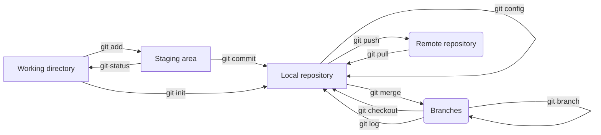

# Git

## Table of contents

1. [Git Commands](#git-commands)
    1. [Local Commands](#local-commands)
        1. [version](#git-version)
        2. [init](#git-init)
        3. [commit](#git-commit)
        4. [status](#git-status)
        5. [add](#git-add)
        6. [config](#git-config)
        7. [log](#git-log)
        8. [checkout](#git-checkout)
        9. [branch](#git-branch)
        9. [merge](#git-merge)
    2. [Remote Commands](#remote-commands)
        1. [clone](#git-clone)
        2. [remote](#git-remote)
        3. [pull](#git-pull)
        4. [push](#git-push)
        5. [merge](#git-merge-remote)
2. [Overview](#overview)
3. [FAQ](#faq)
    1. [Working as a team](#working-as-a-team)
        1. [Merge conflict](#merge-conflict)
        2. [Solve merge conflict](#solve-merge-conflict)
    2. [GitHub](#github)

## Git commands

### Local commands

#### git version

```
$ git version
```

Check the version of your Git.

[Official documentation](https://git-scm.com/docs/git-version)

#### git init

```
$ git init
```

Initialize new git monitorer.

[Official documentation](https://git-scm.com/docs/git-init)

#### git commit

```
$ git commit
```

Commit saves the current state of your project.

[Official documentation](https://git-scm.com/docs/git-commit)

#### git status

```
$ git status
```

You can see what files tracked and which would be
commited.

[Official documentation](https://git-scm.com/docs/git-status)

#### git add

```
$ git add
```

Add new files to track in the repository. To stage all untracked files type: `git add .` or `git add -A`

[Official documentation](https://git-scm.com/docs/git-add)

#### git config

```
$ git config
```

With this command you can tell git who the author is so that the commit can be saved in your name. `git config --global user.name "Your Name"` to add a username and `git config --global user.email "your@email.com"` to add your email.

[Official documentation](https://git-scm.com/docs/git-config)

#### git log

```
$ git log
```

Git log is used to display all the repository's commits from the current branch.

[Official documentation](https://git-scm.com/docs/git-log)

#### git checkout

```
$ git checkout <branch>
```

Used to switch to another branch or to create and switch to a new one. To create a branch type `git checkout -b <name>`

[Official documentation](https://git-scm.com/docs/git-checkout)

#### git branch

```
$ git branch
```

Add a new branch to an already existing branch. You can list all branches and delete branches with this command. To remove a branch type `git branch --delete <name>`

[Official documentation](https://git-scm.com/docs/git-branch)

#### git merge

```
$ git merge
```

You can use this to merge already existing commits from a branch into the current branch. `git checkout <branch>` to the branch you want to merge a branch into before merging.

[Official documentation](https://git-scm.com/docs/git-merge)


### **Remote commands**

#### git clone

```
$ git clone "https://github.com/<repo-url>"
```

This command takes a path (URL) to a GitHub repository. git clone creates a local copy of a remote repository's source code. You can use this command when you for example want to continue working on your project on another device.

[Official documentation](https://git-scm.com/docs/git-clone)

#### git remote

```
$ git remote add <branch> <https://github.com/<user>/<repo-url>
```

This command lets you create, delete, view and manage connections to other repositories. You can use this command to establish a connection to GitHub which lets you "push" and "pull" to and from the repository.

[Official documentation](https://git-scm.com/docs/git-remote)

#### git pull

```
$ git pull
```

This command fetches the content from the remote repository and integrates it to your cloned local repository. Use this command to stay up to date with the latest commits.

[Official documentation](https://git-scm.com/docs/git-pull)

#### git push

```
$ git push
```

This command pushes the changes from your local repository to the remote repository you have set up with GitHub. Use this command when you want to upload or share your
work.

[Official documentation](https://git-scm.com/docs/git-push)

#### git merge (remote)

```
$ git merge <branch>
```

This command can be used remote and locally. It merges already existing commits from one branch into the current one. You can use this when you want to combine branches.

[Official documentation](https://git-scm.com/docs/git-merge)

## Overview


## FAQ

### Working as a team

#### Merge conflict?
- When working with git as a team you do not want to be working in the same file. When you commit and push your version of a file and then a team member does the same without pulling your version a conflict will occur.
#### Solve merge conflict
- Then you have to solve a merge conflict. To avoid this you can divide work into separate files which allows you to work together and not interfere with each others code.

### GitHub

GitHub is a code hosting platform made for version control and collaborating on code projects. It lets you work together with others on different projects from anywhere in the world. You need GitHub to be able to store your work in the cloud and access it from anywhere. It is a great tool and asset for developers.