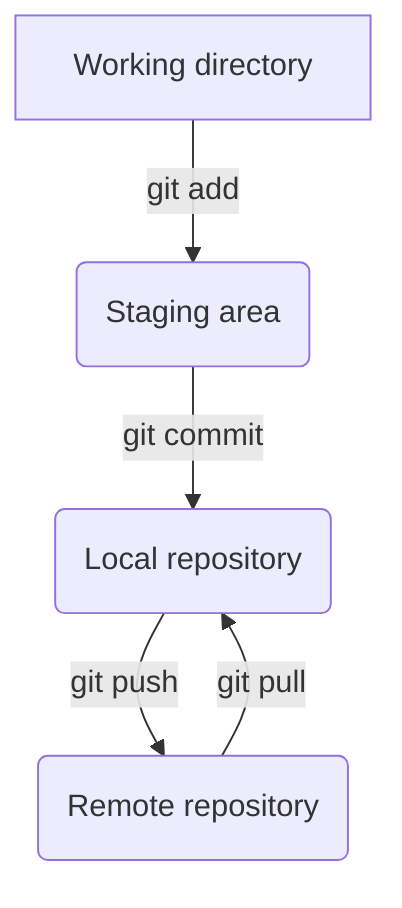

# Personal wiki

## **Tools**

### **Visual Studio Code**

[![VSCode][vscode]][vscode-url]

- Code editor
- I am used to and it has helpful extensions to ease the work flow.

### **Microsoft Edge**

[![Edge][edge]][edge-url]

- Web Browser
- It comes built-in Windows 10 & 11.

### **Git**

[![Git][git]][git-url]

- Open source distributed version control system.
- I use it to track and monitor my projects and upload it to github.

### **Node.js**

[![Node][node.js]][node-url]

- JavaScript Runtime
- Use Node.js to execute JavaScript programs

### **Virtual Machine**

- username: vboxuser
- password:

<br/>

### **10 Git commands**

```
git version
```

Check the version of your Git.

```
git init
```

Initialize new git monitorer.

```
git commit
```

Commit saves the current state of your project.

```
git status
```

You can see what files tracked and which would be
commited.

```
git add
```

Add new files to track in the repository.

```
git config
```

With this command you can tell git who the author is so that the commit can be saved in your name.

```
git log
```

Git log is used to display all the repository's commits from the current branch.

```
git checkout
```

Used to switch to another branch or to create and switch to a new one.

```
git branch
```

Add a new branch to an already existing branch. You can list all branches and delete branches with this command.

```
git merge
```

You can use this to merge already existing commits from a branch into the current branch.



### **Working with Git as a team**

- **What is a merge conflict?**
- When working with git as a team you do not want to be working in the same file. When you commit and push your version of a file and then a team member does the same without pulling your version a conflict will occur.
- **How to solve a merge conflict?**
- Then you have to solve a merge conflict. To avoid this you can divide work into separate files which allows you to work together and not interfere with each others code.

### **GitHub**

GitHub is a code hosting platform made for version control and collaborating on code projects. It lets you work together with others on different projects from anywhere in the world. You need GitHub to be able to store your work in the cloud and access it from anywhere. It is a great tool and asset for developers.

### **SSH key**

Added a secure trusted way to communicate between my local machine and GitHub account using an SSH key.

[vscode]: https://img.shields.io/badge/Visual_Studio_Code-0078D4?style=for-the-badge&logo=visual%20studio%20code&logoColor=white
[vscode-url]: https://code.visualstudio.com/
[git]: https://img.shields.io/badge/GIT-E44C30?style=for-the-badge&logo=git&logoColor=white
[git-url]: https://git-scm.com/
[edge]: https://img.shields.io/badge/Microsoft_Edge-0078D7?style=for-the-badge&logo=Microsoft-edge&logoColor=white
[edge-url]: https://www.microsoft.com/edge
[node.js]: https://img.shields.io/badge/Node.js-43853D?style=for-the-badge&logo=node.js&logoColor=white
[node-url]: https://nodejs.org/
